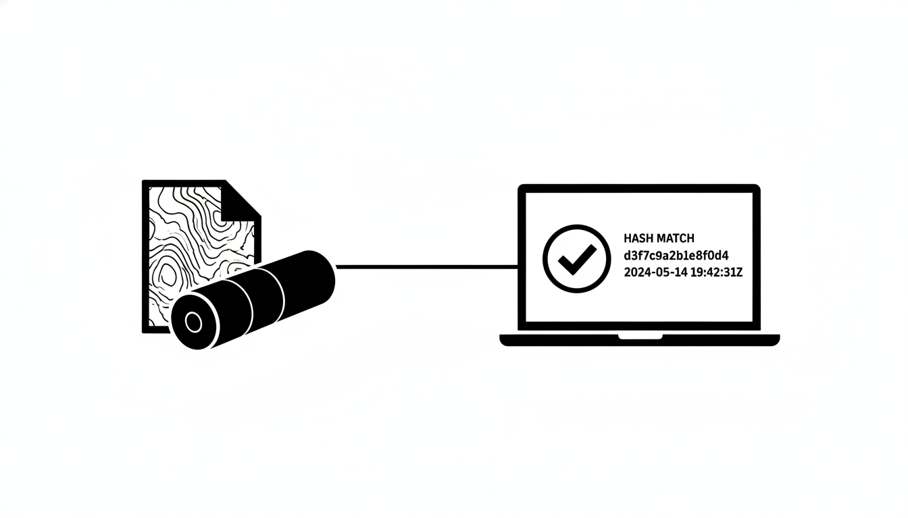

<<<<<<< HEAD

=======
[](./res/dpp-logo.png)
>>>>>>> 560258f28882a72ce5df028e6a1c7e571a491a4b

# Data Provenance Protocol (DPP)

Open, domain-independent protocol for cryptographically verifiable data provenance on the internet. Manifest + hashes + signature + chaining.
Self-contained verification, no platform, no server, no need to go back to the source.

## Rationale

Internet data exchange lacks a generic protocol for verifiable provenance. TLS and DNSSEC secure the connection, not the object. DPP adds the missing layer: persistent proof of origin.

Five EU regulations take effect in 2026 requiring provenance without a technical protocol: AI Act, Cyber Resilience Act, Digital Product Passport, Data Act, CSRD.

## Structure

```
├── spec/                    # CC0 — protocol specification (org-mode)
│   ├── dpp-specification.org
│   ├── manifest-schema.json
│   ├── collection-manifest-schema.json
│   └── examples/
├── cli/                     # GPLv3+ — Python CLI: init, add, sign, verify, report
├── web/                     # MIT — TypeScript + SCSS, Vite, browser verification
├── demo/bim/                # ifckit + DPP demonstrator
├── demo/gis/                # onderlegger + DPP demonstrator
└── docs/                    # User guide, examples (org-mode)
```

## Plan

Duration: September 2026 – February 2027 (6 months, 26 weeks). SIDN Pioniers.

### Phases

| Phase | What | When |
|-------|------|------|
| 1. Specification v1.0 | Protocol document: manifest format (JSON), signing (Sigstore/GPG/PKCS#7), verification semantics, domain extension model, chaining. CC0, as Internet-Draft. | Sep–Oct 2026 |
| 2. DPP CLI | Python tool on PyPI (GPLv3+). Five commands: init, add, sign, verify, report. Domain-independent. Test coverage ≥80%. | Oct–Dec 2026 |
| 3. Web verification demo | Static GitHub Pages site (MIT). Upload manifest + files, browser-based verification via Web Crypto API. No server, no account. | Nov–Dec 2026 |
| 4. BIM demonstrator | ifckit integrates DPP manifest into IFC generation. Workflow: parameterize house type, generate IFC, DPP delivery with multi-party signing. | Nov 2026–Jan 2027 |
| 5. GIS demonstrator | onderlegger.mauc.nl integrates DPP collection manifest. Pulls data from Kadaster, PDOK, KLIC, DSO and records per source: URL, timestamp, response hash. | Nov 2026–Jan 2027 |
| 6. Documentation + wrap-up | Manual, examples, blog post. CodeSupply positioning document. | Jan–Feb 2027 |

### Two modes

| Mode | What it proves | Who signs |
|------|---------------|-----------|
| Server-side | "This data comes from source X" | Data provider |
| Client-side | "This is what I received from source Y, at T" | Data collector |

### Deliverables

1. Specification v1.0 (CC0): Internet-Draft, JSON manifest, signing, verification, chaining
2. DPP CLI on PyPI (GPLv3+): init, add, sign, verify, report
3. Web verification demo (MIT): GitHub Pages, browser-based verification
4. BIM demonstrator: ifckit + DPP, multi-party signing
5. GIS demonstrator: onderlegger.mauc.nl + DPP, signed collection manifest
6. CodeSupply positioning document

Success criterion: a third party can read the specification, install the CLI, and create their own manifest for their own data — without explanation, regardless of domain.
